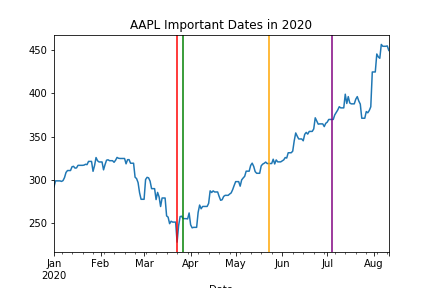
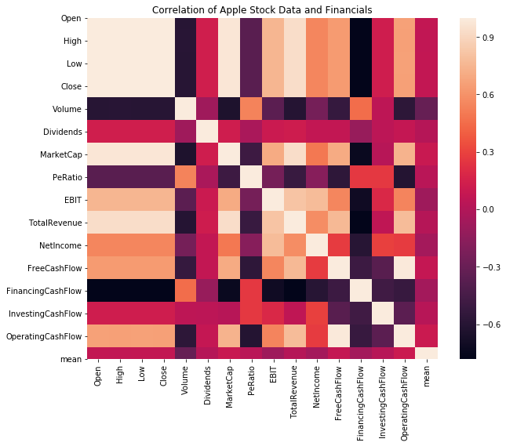

# Stock Trading MVP
By J Daniel Kim

### Overall goal
Recently, there has been a rise of retail traders in the market. The purpose of this project is to create a easy to use equity trading service that helps take emotional decisions out as a factor. Also, I want to discover if my model could profit in the 2020.
### MVP goal
Gather and explore the correct financial data. Fit a couple univariate baseline and neural network models. The models I have used is a Bivariate LSTM model, Single layer neural network, VARIMAX, and ARIMAX. Used only the Long Only strategy predicting daily closing prices.

### Data
The data was collected from Yahoo finance. It contains historical valuation metrics, three financial statements, and  stock prices.

### Best model for fitting
Univariate AAPL Single layer Neural Network
- RMSE: 12.14
- MSE: 147.4
- MAE:8.0
- Pct growth: 54%
- Accuracy: 54%

### EDA


```python
from IPython.display import Image
Image(filename= "AAPL_Important_Dates_in_2020.png")
```





Dates:
- 2020-03-23: S&P hit their lowest point
- 2020-03-27: Stimulus package
- 2020-05-23: Memorial Day Weekend
- 2020-07-04: July 4th


Investors hopes rise after the crash for the Apple Stock.


```python
Image(filename= "Correlation_of_Apple_Stock_Data_and_Financials.png")
```





Contains all the features I used. 

### Model Fitting
The model predicts the next day based on the past two days. Then is converted into a percent change to determine to long or short. 


```python
Image(filename= "AAPL_Single_Layer_NN_Tuned.png")
```


After getting the output I changed it to percent change. Then binarized the output (1 for increases and 0 for other). Therefore, 1 would mean to long a stock. Next I percent changed the validation set and groupby the values I predicted as 1. Then I aggregated the growth rate up to the current day that I predicted to long. This model accounts for days I misaccurately predicted as well. As mentioned before, the return on investment is 54%

### Recommendations
This basic model and research can be used to help predict whether to short or long the stock price. In the future, I want to predict just the percent changes instead of the stock price to help determine whther to go long or short. In addition, fit the model to all top ten market cap stocks, fit a couple highly volitile stocks, and create an attention layer neural network.

### Sources 
- 'Using LSTM in Stock prediction and Quantitative Trading', Zhichao Zou and Zihao Qu 
- 'Time Series Prediction with LSTMs using TensorFlow 2 and Keras in Python', Venelin Valkov
- 'Sequences, Time Series and Prediction', Laurence Moroney
