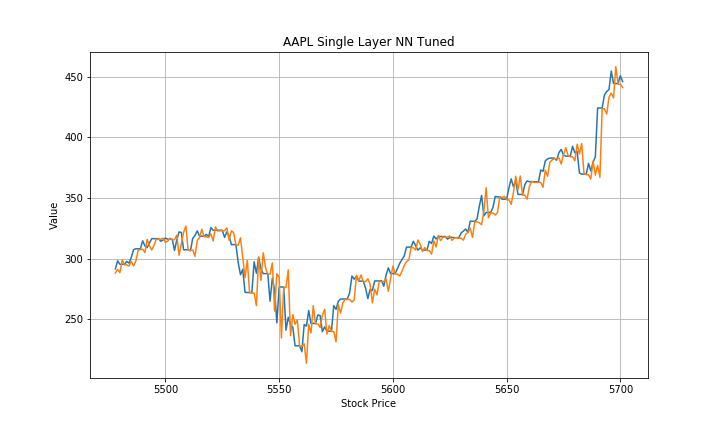

# Stock Trading MVP
By J Daniel Kim

### Overall goal
Recently, there has been a rise of retail traders in the market. The purpose of this project is to create a easy to use equity trading service that helps take emotional decisions out of the factor. Also, I want to discover if my model could profit in the 2020.
### MVP goal
Gather and explore the correct financial data. Fit a couple univariate baseline and neural network models. 

### Data
The data was collected from Yahoo finance. It is about historical valuation metrics, three financial statements, and  stock prices.

### Best model for fitting
Univariate AAPL Single layer Neural Network
- RMSE: 12.14
- MSE: 147.4
- MAE:8.0
- Pct growth: 54%
- Accuracy: 54%

### EDA


```python
from IPython.display import Image
Image(filename= "AAPL_Important_Dates_in_2020.png")
```


Dates:
- 2020-03-23: S&P hit their lowest point
- 2020-03-27: Stimulus package
- 2020-05-23: Memorial Day Weekend
- 2020-07-04: July 4th


```python
Image(filename= "Correlation_of_Apple_Stock_Data_and_Financials.png")
```


### Model Fitting
The model predicts the next day based on the past two days. Then is converted into a percent change to determine to long or short. 


```python
Image(filename= "AAPL_Single_Layer_NN_Tuned.png")
```





### Recommendations
This basic model and research can be used to help predict whether to short or long the stock price. In the future, I want to predict just the percent changes instead of the stock price to help determine whther to go long or short. In addition, fit the model to all top ten market cap stocks, fit a couple highly volitile stocks, and create an attention layer neural network.
